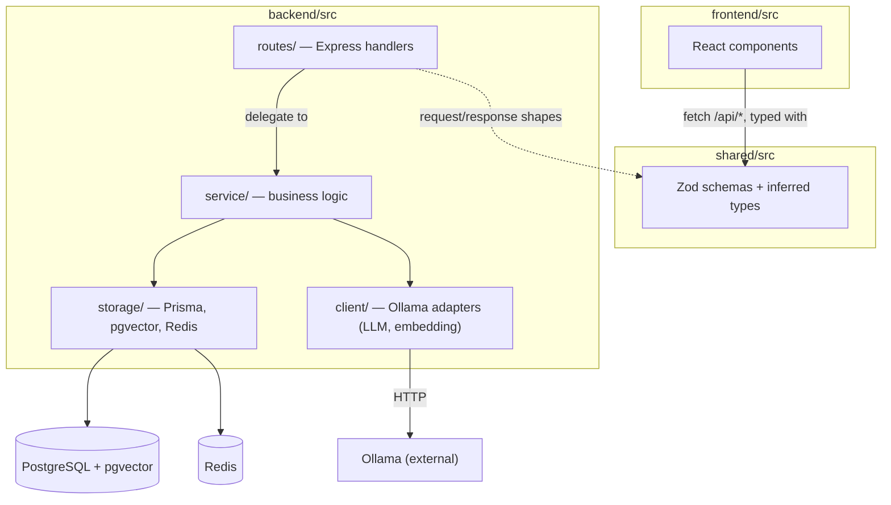
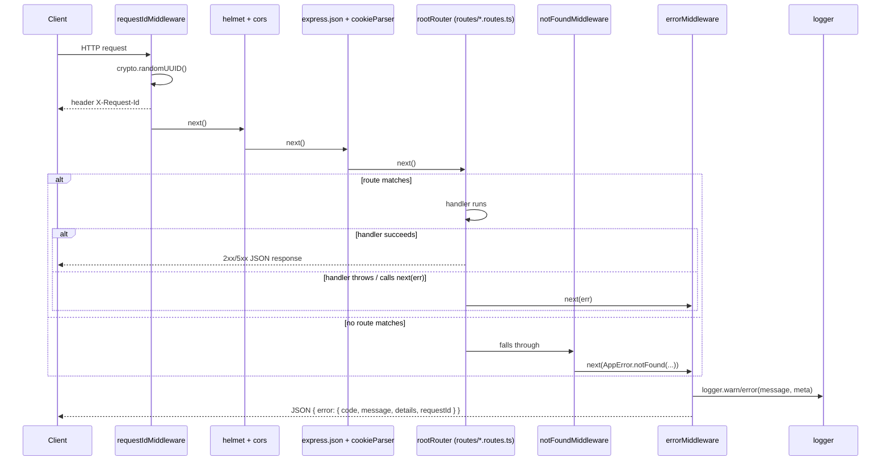
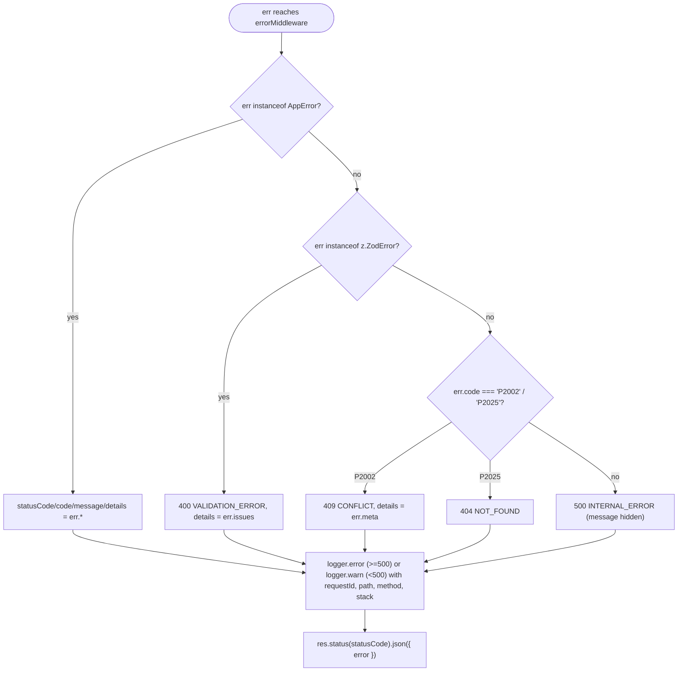
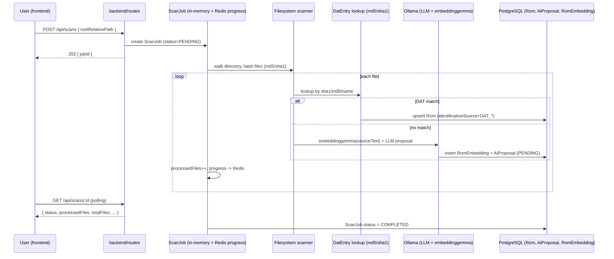

# Architecture

## 1. Layers

The backend (`backend/src/`) is split into four layers, each depending only on
the one below it (see [CONVENTIONS.md](../CONVENTIONS.md#project-structure)):

## 2. Backend HTTP request lifecycle

Every request goes through the same **middleware chain**, assembled in
[`backend/src/app.ts`](../backend/src/app.ts). **The order matters:** the
request ID must exist before anything can be logged, and the error handler must
be last so it can catch whatever `next(err)` was called with.

- **`requestIdMiddleware`** (`backend/src/middleware/request-id.middleware.ts`):
  generates one UUID per request, exposes it as `res.locals.requestId` and as
  the `X-Request-Id` response header, so a client-reported bug can be traced to
  one log line.
- **`notFoundMiddleware`** (`backend/src/middleware/not-found.middleware.ts`):
  the last handler mounted before the error handler; turns any unmatched route
  into an `AppError.notFound(...)` instead of Express's default HTML 404 page.
- **`validate.middleware.ts`**: wraps a route with `{ body?, query?, params? }`
  Zod schemas; a failed `parseAsync` calls `next(err)` with the raw
  `z.ZodError`, which `errorMiddleware` maps to `400 VALIDATION_ERROR`.

## 3. Error handling: `AppError` → `errorMiddleware` → `ApiError`

Two types anchor the error contract, one on each side of the wire:

- **`AppError`** (`backend/src/lib/error.ts`) the only error type route/service
  code should throw on purpose. It carries `statusCode`, a machine-readable
  `code`, a human `message` and optional `details`, plus factories
  (`AppError.notFound`, `.badRequest`, `.unauthorized`, `.conflict`,
  `.serviceUnavailable`) so call sites never hardcode a status number.
- **`ApiError`** (`shared/src/schemas/api.schema.ts`) the Zod schema (and
  inferred type) for the JSON envelope the client actually receives:
  `{ error: { code, message, details?, requestId } }`. It is imported by both
  workspaces, so the frontend can parse an error response with the same schema
  the backend used to shape it.

`errorMiddleware` (`backend/src/middleware/error.middleware.ts`) is the single
place that turns _any_ thrown value into an `ApiError`-shaped response:

Stack traces are only ever written to the log (via `logger`), never returned in
the HTTP response — this is what keeps `NODE_ENV=production` from leaking
internals, per
[US1.3's DoD](./monitoring/sprint-01.md#us13--robustesse-http--erreurs-validation-journalisation).

## 4. Logger

`backend/src/lib/logger.ts` is a minimal structured logger with no external
dependency: `debug`/`info`/`warn`/`error`, each writing one JSON line
(`{ timestamp, level, msg, ...meta }`) to `stdout`, except `error` which writes
to `stderr`. In production (`NODE_ENV=production`) `debug` lines are filtered
out; every other environment logs everything. `errorMiddleware` always passes
`requestId` in `meta`, so log lines for the same request can be grep'd together
even though the logger itself has no session/correlation state.

## 5. End-to-end scan flow (target — not yet implemented)

The Prisma schema (`backend/prisma/schema.prisma`) already models the full scan
→ identify → group pipeline; the `service/`/`storage`/`client` code that
implements it is planned for a later sprint. This sequence is the target flow,
kept here so the HTTP/error/logging layer above is designed against real future
call sites instead of guesswork:

See
[ADR-010](./adr/010-embeddinggemma-vectors-in-pgvector-for-semantic-grouping.md),
[ADR-011](./adr/011-opaque-redis-sessions-with-argon2id.md) and
[ADR-012](./adr/012-in-process-job-with-redis-progress-no-bullmq.md) for the
decisions behind the vector search, auth and job-progress pieces of this flow.
