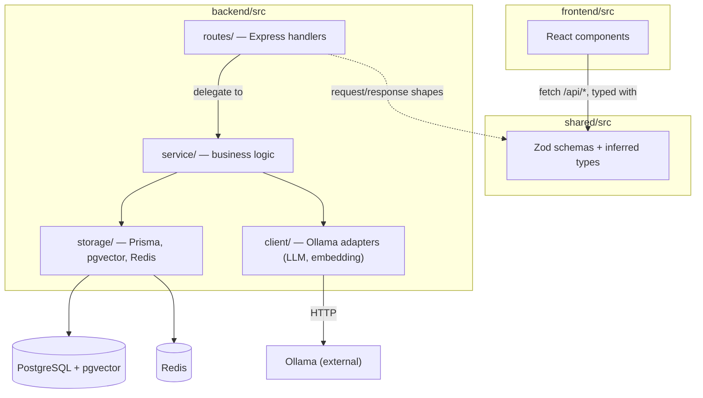
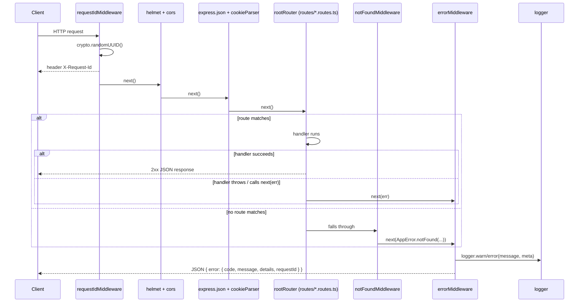
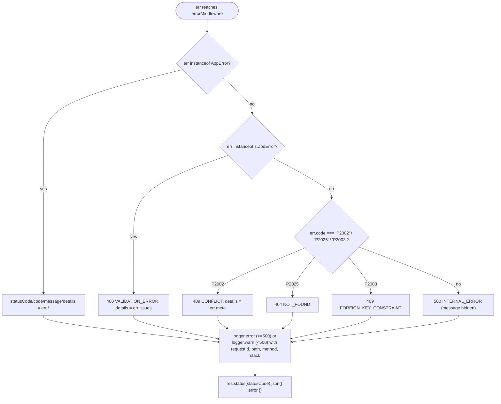
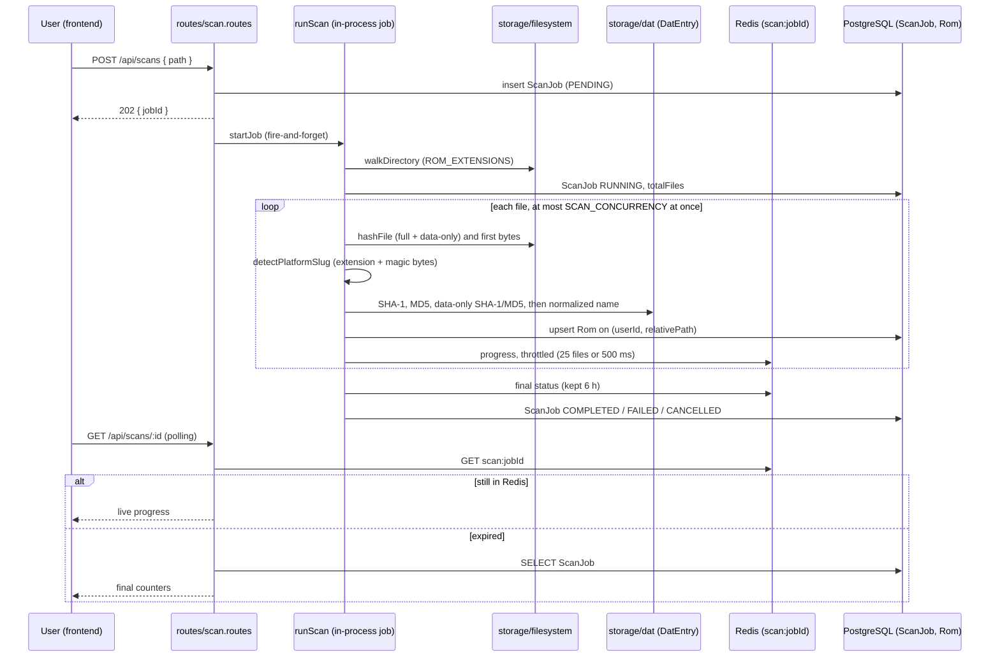

# Architecture

## 1. Layers

The backend (`backend/src/`) is split into four layers, each depending only on
the one below it (see [CONVENTIONS.md](../CONVENTIONS.md#project-structure)).

```mermaid
graph TD
    subgraph Frontend["frontend/src"]
        UI["React components"]
    end

    subgraph Shared["shared/src"]
        Schemas["Zod schemas + inferred types"]
    end

    subgraph Backend["backend/src"]
        Routes["routes/ — Express handlers"]
        Service["service/ — business logic"]
        Storage["storage/ — Prisma, pgvector, Redis"]
        Client["client/ — Ollama adapters (LLM, embedding)"]
    end

    DB[(PostgreSQL + pgvector)]
    Cache[(Redis)]
    Ollama["Ollama (external)"]

    UI -->|fetch /api/*, typed with| Schemas
    Routes -->|delegate to| Service
    Service --> Storage
    Service --> Client
    Storage --> DB
    Storage --> Cache
    Client -->|HTTP| Ollama
    Routes -.->|request/response shapes| Schemas
```

## 2. Backend HTTP request lifecycle

Every request goes through the same **middleware chain**, assembled in
[`backend/src/app.ts`](../backend/src/app.ts). **The order matters:** the
request ID must exist before anything can be logged, and the error handler must
be last so it can catch whatever `next(err)` was called with.

```mermaid
sequenceDiagram
    participant C as Client
    participant RID as requestIdMiddleware
    participant SEC as helmet + cors
    participant BODY as express.json + cookieParser
    participant R as rootRouter (routes/*.routes.ts)
    participant NF as notFoundMiddleware
    participant ERR as errorMiddleware
    participant L as logger

    C->>RID: HTTP request
    RID->>RID: crypto.randomUUID()
    RID-->>C: header X-Request-Id
    RID->>SEC: next()
    SEC->>BODY: next()
    BODY->>R: next()

    alt route matches
        R->>R: handler runs
        alt handler succeeds
            R-->>C: 2xx JSON response
        else handler throws / calls next(err)
            R->>ERR: next(err)
        end
    else no route matches
        R->>NF: falls through
        NF->>ERR: next(AppError.notFound(...))
    end

    ERR->>L: logger.warn/error(message, meta)
    ERR-->>C: JSON { error: { code, message, details, requestId } }
```

- **`requestIdMiddleware`** (`backend/src/middleware/request-id.middleware.ts`):
  generates one UUID per request, exposes it as `res.locals.requestId` and as
  the `X-Request-Id` response header, so a client-reported bug can be traced to
  one log line.
- **`notFoundMiddleware`** (`backend/src/middleware/not-found.middleware.ts`):
  the last handler mounted before the error handler; turns any unmatched route
  into an `AppError.notFound(...)` instead of Express's default HTML 404 page.
- **`validate.middleware.ts`**: wraps a route with `{ body?, query?, params? }`
  Zod schemas; a failed `parseAsync` calls `next(err)` with the raw
  `z.ZodError`, which `errorMiddleware` maps to `400 VALIDATION_ERROR`.
- **`requireAuth`** (`backend/src/middleware/require-auth.middleware.ts`): not
  part of the global chain but mounted per route (library, scans, `/auth/me`);
  it resolves the session cookie into `res.locals.userId` through Redis, or
  answers `401 UNAUTHENTICATED` (see
  [ADR-011](./adr/011-opaque-redis-sessions-with-argon2id.md)).

## 3. Error handling: `AppError` → `errorMiddleware` → `ApiError`

Two types anchor the error contract, one on each side of the wire:

- **`AppError`** (`backend/src/lib/error.ts`) the only error type route/service
  code should throw on purpose. It carries `statusCode`, a machine-readable
  `code`, a human `message` and optional `details`, plus factories
  (`AppError.notFound`, `.badRequest`, `.unauthorized`, `.conflict`,
  `.serviceUnavailable`) so call sites never hardcode a status number.
- **`apiErrorSchema`** (`shared/src/schemas/api.schema.ts`, inferred type
  `ApiError` in `shared/src/types/api.types.ts`) the Zod schema for the JSON
  envelope the client actually receives:
  `{ error: { code, message, details?, requestId } }`. The frontend parses every
  failed response with it (`frontend/src/lib/api-client.ts`) and throws an
  `ApiError` instance (`frontend/src/lib/api-error.ts`) that keeps the `code`,
  so the UI can react to `INVALID_CREDENTIALS` or `OLLAMA_UNAVAILABLE` instead
  of showing a generic error.

`errorMiddleware` (`backend/src/middleware/error.middleware.ts`) is the single
place that turns _any_ thrown value into an `ApiError`-shaped response:

```mermaid
flowchart TD
    Start(["err reaches errorMiddleware"]) --> IsApp{"err instanceof AppError?"}
    IsApp -->|yes| UseApp["statusCode/code/message/details = err.*"]
    IsApp -->|no| IsZod{"err instanceof z.ZodError?"}
    IsZod -->|yes| UseZod["400 VALIDATION_ERROR, details = err.issues"]
    IsZod -->|no| IsPrisma{"err.code === 'P2002' / 'P2025' / 'P2003'?"}
    IsPrisma -->|P2002| UseConflict["409 CONFLICT, details = err.meta"]
    IsPrisma -->|P2025| UseNotFound["404 NOT_FOUND"]
    IsPrisma -->|P2003| UseForeignKey["409 FOREIGN_KEY_CONSTRAINT"]
    IsPrisma -->|no| UseDefault["500 INTERNAL_ERROR (message hidden)"]

    UseApp --> Log
    UseZod --> Log
    UseConflict --> Log
    UseNotFound --> Log
    UseForeignKey --> Log
    UseDefault --> Log

    Log["logger.error (>=500) or logger.warn (<500) with requestId, path, method, stack"] --> Respond["res.status(statusCode).json({ error })"]
```

Stack traces are only ever written to the log (via `logger`), never returned in
the HTTP response — this is what keeps `NODE_ENV=production` from leaking
internals, per
[US1.3's DoD](./monitoring/sprint-01.md#us13--robustesse-http--erreurs-validation-journalisation).

## 4. Logger

`backend/src/lib/logger.ts` is a minimal structured logger with no external
dependency: `debug`/`info`/`warn`/`error`, each writing one JSON line
(`{ timestamp, level, msg, ...meta }`) to `stdout`, except `error` which writes
to `stderr`. In production (`NODE_ENV=production`) `debug` lines are filtered
out; every other environment logs everything. `errorMiddleware` always passes
`requestId` in `meta`, so log lines for the same request can be grep'd together
even though the logger itself has no session/correlation state.

## 5. End-to-end scan flow

A scan is **deterministic and never calls Ollama**: it identifies ROMs against
the imported No-Intro catalogs only, so it keeps working when Ollama is down.
The AI step runs afterwards, on demand, on the ROMs the scan left
`UNIDENTIFIED`.

The pieces, from the HTTP layer down:

- **`routes/scan.routes.ts`** validates the root with `isLibraryDirectory`
  (inside `ROM_LIBRARY_ROOT`, real path, so a symlink cannot escape it), inserts
  the `ScanJob` row, starts the job and answers `202 { jobId }` at once. It is
  also where the real filesystem, DAT catalogs, Redis and PostgreSQL are plugged
  into the orchestration.
- **`lib/job-runner.ts`** runs the job in the backend process and keeps one
  `AbortController` per job, which `DELETE /api/scans/:id` aborts. A restart
  loses running jobs, an accepted limit
  ([ADR-012](./adr/012-in-process-job-with-redis-progress-no-bullmq.md)).
- **`service/scan.service.ts`** (`runScan`) is pure orchestration: it receives
  every I/O as a dependency, processes at most `SCAN_CONCURRENCY` files at a
  time with a small semaphore, counts a failing file as an error without
  stopping, and skips the remaining files once aborted.
- **`service/identification.service.ts`** applies the six-step cascade and keeps
  the progress in memory, flushing it to Redis every 25 files or 500 ms.

```mermaid
sequenceDiagram
    participant U as User (frontend)
    participant API as routes/scan.routes
    participant Job as runScan (in-process job)
    participant FS as storage/filesystem
    participant DAT as storage/dat (DatEntry)
    participant R as Redis (scan:jobId)
    participant DB as PostgreSQL (ScanJob, Rom)

    U->>API: POST /api/scans { path }
    API->>DB: insert ScanJob (PENDING)
    API-->>U: 202 { jobId }
    API->>Job: startJob (fire-and-forget)
    Job->>FS: walkDirectory (ROM_EXTENSIONS)
    Job->>DB: ScanJob RUNNING, totalFiles
    loop each file, at most SCAN_CONCURRENCY at once
        Job->>FS: hashFile (full + data-only) and first bytes
        Job->>Job: detectPlatformSlug (extension + magic bytes)
        Job->>DAT: SHA-1, MD5, data-only SHA-1/MD5, then normalized name
        Job->>DB: upsert Rom on (userId, relativePath)
        Job->>R: progress, throttled (25 files or 500 ms)
    end
    Job->>R: final status (kept 6 h)
    Job->>DB: ScanJob COMPLETED / FAILED / CANCELLED
    U->>API: GET /api/scans/:id (polling)
    API->>R: GET scan:jobId
    alt still in Redis
        API-->>U: live progress
    else expired
        API->>DB: SELECT ScanJob
        API-->>U: final counters
    end
```

The identification cascade stops at the first match, from the strongest proof to
the weakest:

| Step | Criterion                                            | `identificationSource` | Confidence |
| ---- | ---------------------------------------------------- | ---------------------- | ---------- |
| 1    | SHA-1 of the whole file                              | `DAT_SHA1`             | 1.00       |
| 2    | MD5 of the whole file                                | `DAT_MD5`              | 0.99       |
| 3    | SHA-1 of the data, header skipped (NES, SNES copier) | `DAT_SHA1_DATA`        | 0.97       |
| 4    | MD5 of the data, header skipped                      | `DAT_MD5_DATA`         | 0.96       |
| 5    | Normalized name, unique for this extension           | `DAT_NAME`             | 0.80       |
| 6    | Nothing                                              | `UNIDENTIFIED`         | 0          |

Steps 3 and 4 only run when a header was detected (`headerBytesSkipped > 0`),
which avoids useless queries for Game Boy, Game Boy Color and GBA ROMs.

See
[ADR-010](./adr/010-embeddinggemma-vectors-in-pgvector-for-semantic-grouping.md),
[ADR-011](./adr/011-opaque-redis-sessions-with-argon2id.md) and
[ADR-012](./adr/012-in-process-job-with-redis-progress-no-bullmq.md) for the
decisions behind the vector search, auth and job-progress pieces of this flow.
