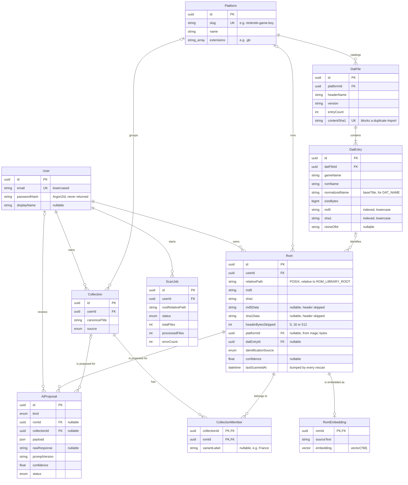

# Data model

**Source of truth:
[`backend/prisma/schema.prisma`](../backend/prisma/schema.prisma).** This
document is written by hand from that file and must be updated in the same PR
whenever the schema changes (see
[US1.6](./monitoring/sprint-01.md#us16--dette-documentaire-et-outillage)).

## Entity-relationship diagram

Only keys, relations and the columns the pipeline relies on are shown; see the
schema for every field.

## Enums

- **`IdentificationSource`** (`Rom.identificationSource`) records how a ROM got
  its metadata, from the strongest proof to the weakest:
  - `DAT_SHA1` / `DAT_MD5`: the whole file matches a `DatEntry` hash;
  - `DAT_SHA1_DATA` / `DAT_MD5_DATA`: the file matches once its copier/iNES
    header is skipped (`headerBytesSkipped`), so it is the right game with a
    different header;
  - `DAT_NAME`: the normalized file name matches exactly one `DatEntry` of the
    same extension (no hash match);
  - `AI_PROPOSED`: an `AiProposal` is pending;
  - `USER_CONFIRMED`: a human validated an AI proposal;
  - `UNIDENTIFIED`: no match, no proposal yet.
- **`AiProposalKind`** (`AiProposal.kind`) with `IDENTIFICATION` (metadata guess
  for one `Rom`) vs `GROUPING` (variants of the same game should form one
  `Collection`). The kind determines whether `romId` or `collectionId` is set.
- **`AiProposalStatus`** (`AiProposal.status`) is set to `PENDING` until a user
  reviews it (`reviewedAt`/`reviewedById` set), then `ACCEPTED` or `REJECTED`.
  An accepted `GROUPING` proposal is what creates/extends a `Collection`.
- **`CollectionSource`** (`Collection.source`) means how the collection was
  formed: `DAT_CLONE` (the DAT file already lists variants via `cloneOfId`),
  `AI` (from an accepted `GROUPING` proposal, see
  [ADR-010](./adr/010-embeddinggemma-vectors-in-pgvector-for-semantic-grouping.md)),
  or `MANUAL` (user-created).
- **`ScanJobStatus`** (`ScanJob.status`) is the lifecycle of a directory scan:
  `PENDING` → `RUNNING` → `COMPLETED` / `FAILED` / `CANCELLED`. See
  [ADR-012](./adr/012-in-process-job-with-redis-progress-no-bullmq.md) for how
  progress is tracked and polled.

## Notes

- `RomEmbedding.embedding` is `Unsupported("vector(768)")`: Prisma has no native
  type for a `pgvector` column, so its HNSW index is created by a hand-written
  migration and all similarity queries go through typed `$queryRaw` helpers (see
  [ADR-007](./adr/007-postgresql-with-pgvector-as-the-vector-store.md) and
  [ADR-010](./adr/010-embeddinggemma-vectors-in-pgvector-for-semantic-grouping.md)).
- `Rom` is unique on `(userId, relativePath)`: the same physical file path can
  only exist once per user's library, but the same ROM (by hash) can appear
  under different paths or different users. A rescan upserts on this key, so it
  never duplicates a row and only moves `lastScannedAt` (`@updatedAt`).
- `Rom.relativePath` and `ScanJob.rootRelativePath` are always relative to
  `ROM_LIBRARY_ROOT` and use POSIX separators (`/`), so the same library gives
  the same rows on Windows and Linux. No absolute path is ever stored.
- `Rom.platformId` is set by the scan from the extension and the magic bytes
  (`detectPlatformSlug` in `backend/src/service/rom-file.service.ts`), mapped to
  the platforms seeded by `backend/prisma/seed.ts`.
- `DatEntry.normalizedName` is the `baseTitle` of the game name
  (`backend/src/service/title-normalizer.service.ts`), filled at import: a
  catalog imported before this column existed must be re-imported.
- `ScanJob` is the durable record of a scan; its live progress lives in Redis
  under `scan:<jobId>` for 6 hours, then the API falls back to this row.
- `AiProposal.romId` and `AiProposal.collectionId` are both nullable because a
  proposal targets exactly one of the two, depending on `kind`.
