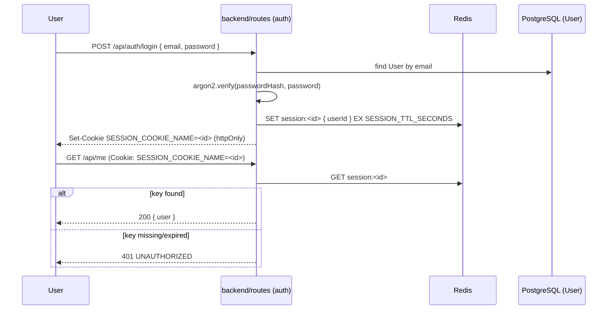

# ADR-011: Opaque Redis sessions with Argon2id, no JWT

**Date:** 2026-09-17

**Status:** Accepted

**Reviewer(s):** @ThFoxY

## Context

**Why is this decision necessary?**

- Every `Rom`, `Collection` and `ScanJob` belongs to a `User`
  (`backend/prisma/schema.prisma`), so authentication is a blocking dependency
  for the rest of the backend (see
  [US1.4](../monitoring/sprint-01.md#us14--authentification-par-session)).
- The stack already runs Redis for job progress (ADR-012) and PostgreSQL for
  everything else, so a session mechanism should not require a third piece of
  infrastructure just for auth.

## Decision

**What has been decided**

- Sessions are **opaque tokens**, not JWTs: on login, the backend generates a
  random session ID, stores `{ userId, createdAt }` in Redis under that ID with
  a TTL of `SESSION_TTL_SECONDS`, and sends the ID back as an `httpOnly`,
  `SameSite=Strict`, `Secure`-in-production cookie named `SESSION_COOKIE_NAME`.
- Every authenticated request reads the cookie, loads the session from Redis,
  and attaches the resolved `User` to the request; a missing or expired key is
  an `AppError.unauthorized(...)`, handled by the existing `errorMiddleware`
  (see
  [ARCHITECTURE.md](../ARCHITECTURE.md#3-error-handling-apperror--errormiddleware--apierror)).
- Logout deletes the Redis key immediately, so a token cannot be replayed after
  the user signs out; a real revocation, which a stateless JWT cannot offer
  without an extra blocklist.
- Passwords are hashed with **Argon2id** (`User.passwordHash`), never stored or
  logged in clear text; `logger` calls in the auth routes must not include the
  raw password or the hash.

## Consequences

**Assets and risks (if any)**

- Asset(s): no JWT secret to rotate or leak; instant, server-side logout; reuses
  infrastructure (Redis) already required for ADR-012, so no new dependency.
- Risk(s): every authenticated request costs one Redis round-trip instead of a
  stateless signature check. If Redis is unreachable, all authenticated routes
  fail closed (503 via `AppError.serviceUnavailable`), which is the intended
  fail-safe behaviour.
