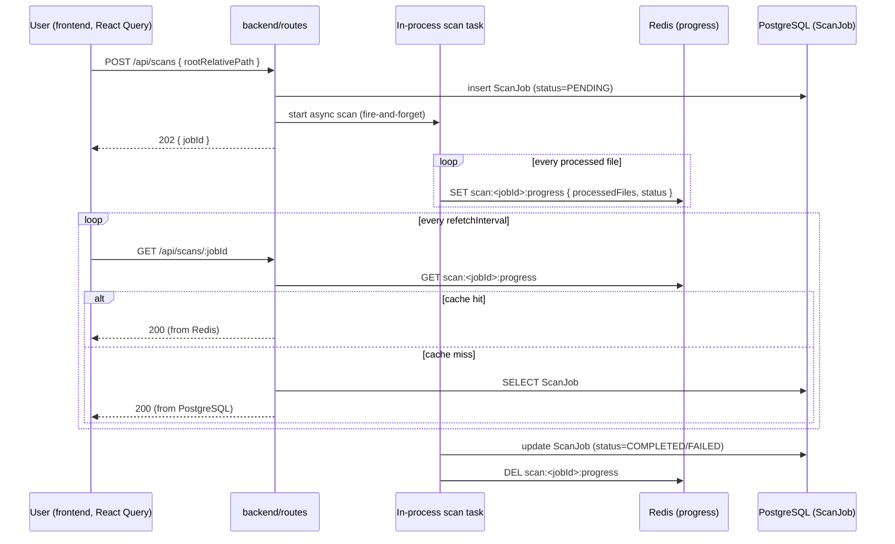

# ADR-012: In-process scan job with Redis progress, no BullMQ

**Date:** 2026-09-17

**Status:** Accepted

**Reviewer(s):** @ThFoxY

## Context

**Why is this decision necessary?**

- A directory scan (hashing files, matching DAT entries, calling Ollama) is
  long-running and must not block the HTTP request that starts it; the frontend
  needs to show live progress.
- `ScanJob` (`backend/prisma/schema.prisma`) already models one row per scan
  (`status`, `totalFiles`, `processedFiles`, `identifiedCount`,
  `unidentifiedCount`, `errorCount`), and `SCAN_CONCURRENCY` is already declared
  in `shared/src/schemas/env.schema.ts`.
- This project runs as a single backend container with no worker pool or
  message-broker deployment target (ADR-006), so the job mechanism must not
  assume horizontal scaling.

## Decision

**What has been decided**

- A scan runs as an `async` function inside the backend's own Node process
  (bounded by `SCAN_CONCURRENCY` concurrent file operations), not on a separate
  queue/worker service. **BullMQ is deliberately not used**: it solves
  multi-worker distribution and retry semantics this single-container project
  does not need, at the cost of an extra Redis-backed queue abstraction to
  operate and test.
- The `ScanJob` PostgreSQL row is the durable record (created `PENDING`, updated
  to `RUNNING`/`COMPLETED`/`FAILED`/`CANCELLED`); Redis holds only the
  **fast-changing counters** (`processedFiles`, live status) under a
  `scan:<jobId>:progress` key with a short TTL, refreshed as files are
  processed, so the frontend is not hammering PostgreSQL on every poll.
- The frontend polls `GET /api/scans/:id` with React Query (`refetchInterval`),
  reading Redis first and falling back to the PostgreSQL row; no WebSocket/SSE
  channel is introduced for this.
- If the backend process restarts mid-scan, the job is left `RUNNING` with stale
  progress.

## Consequences

**Assets and risks (if any)**

- Asset(s): no extra dependency or worker deployment beyond what ADR-006 already
  runs; `ScanJob` alone is enough to resume reasoning about a scan after the
  fact, even if Redis progress has expired.
- Risk(s): a single Node process caps scan throughput to one container. A real
  limit if scans must ever run for many users concurrently, at which point this
  ADR should be revisited and superseded (e.g. by BullMQ).
