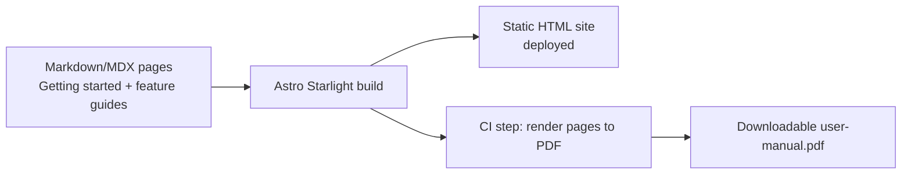

# ADR-013: Astro Starlight for the user documentation site

**Date:** 2026-09-23

**Status:** Accepted

**Reviewer(s):** @NovaChocolat, @ThFoxy

## Context

**Why is this decision necessary?**

- Sprint 7 requires publishing a **user-facing** documentation website: a
  "Getting started" tutorial with installation screenshots, and a
  feature-by-feature manual (e.g. "Sign in", "Feed your library", …) broken
  down in the order a user actually encounters them.
- The same content must also be exportable **automatically** as a PDF, so it
  can be handed out without a browser.
- Existing technical documentation (`docs/ARCHITECTURE.md`, `docs/DATA_MODEL.md`,
  `docs/CHANGELOG.md`, `docs/SECURITY.md`, `docs/AI.md`, this ADR log) already
  lives as plain Markdown in the repository and targets contributors, not
  end users. It must stay where it is; this decision only concerns the new
  **user** manual.
- The stack is TypeScript-first (ADR-002) with React as the UI library
  (ADR-003), so the documentation tooling should not require the team to pick
  up an unrelated language or ecosystem (e.g. Python/Sphinx, Ruby/Jekyll).
- The team has no dedicated technical-writer tooling budget: whatever is
  chosen must be low-maintenance, buildable in CI as a static site, and
  deployable without a custom backend.

## Decision

**What has been decided**

- The user manual is built as a static site with **Astro Starlight**
  (`frontend/... ` is left untouched; the doc site is a **separate** Astro app,
  e.g. `docs-site/`), written in Markdown/MDX.
- Content is organized as pages under a "Getting started" tutorial section
  (installation walkthrough with illustrations) followed by one page per major
  feature, ordered the way a new user encounters them ("Sign in", "Feed your
  library", …), matching Starlight's built-in sidebar/collections model.
- Starlight is chosen over alternatives considered (Docusaurus, VuePress,
  plain MkDocs) because:
  - It runs on **Astro**, which ships zero JS by default and matches the
    project's existing TypeScript tooling (ADR-002), unlike Docusaurus'
    heavier React runtime or MkDocs' separate Python toolchain.
  - It provides search, versioned sidebars, i18n and accessible theming
    out of the box, which the "Manuel" requirement (clarity, exactness,
    user-facing tone) directly needs without extra plugins.
  - It builds to plain static HTML, so it can be deployed the same way as
    the rest of the project's static assets, with no new runtime dependency.
- **PDF generation is automated**, not hand-maintained: a CI step renders the
  built Starlight pages to PDF (headless-browser print, e.g. Playwright/
  `astro-pdf`-style tooling) after each doc build, so the PDF manual never
  drifts from the online one.
- Existing technical Markdown docs (`docs/*.md`, `docs/adr/*.md`) are **not**
  migrated into Starlight; they remain contributor-facing and stay in the
  repository as-is.

## Consequences

**Assets and risks (if any)**

- Asset(s): a single Markdown/MDX source of truth serves both the online
  manual and the auto-generated PDF; TypeScript-consistent tooling means no
  new language/ecosystem for the team to maintain; static output needs no
  dedicated backend or database.
- Risk(s): a second frontend-like app (`docs-site/`) adds a build target to
  CI and a dependency (Astro/Starlight plus the PDF renderer) to keep
  updated; screenshots in the "Getting started" tutorial will need manual
  refreshing whenever the underlying UI changes, since nothing regenerates
  them automatically.
